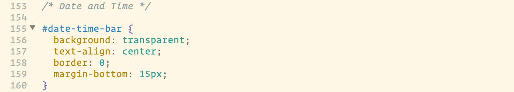
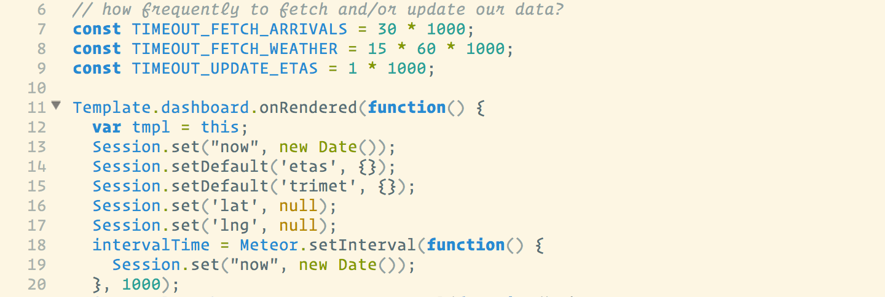
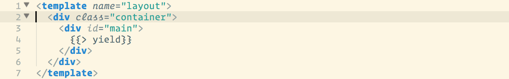
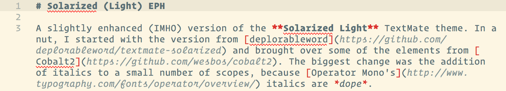

# Solarized (Light) EPH

A slightly enhanced (IMHO) version of the **Solarized Light** TextMate theme. In a nut, I started with the version from [deplorableword](https://github.com/deplorableword/textmate-solarized) and brought over some of the elements from [Cobalt2](https://github.com/wesbos/cobalt2). The biggest change was the addition of italics to a small number of scopes, because [Operator Mono's](http://www.typography.com/fonts/operator/overview/) italics are *dope*.

## Screenshots

### CSS

### JavaScript

### HTML

### Markdown

